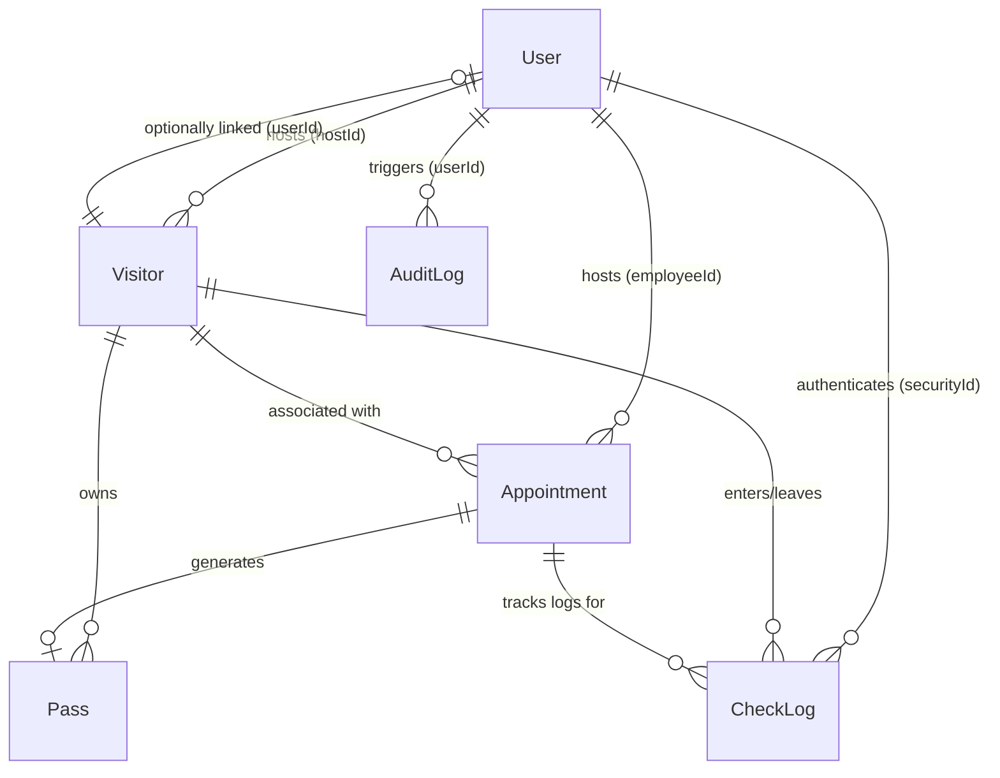
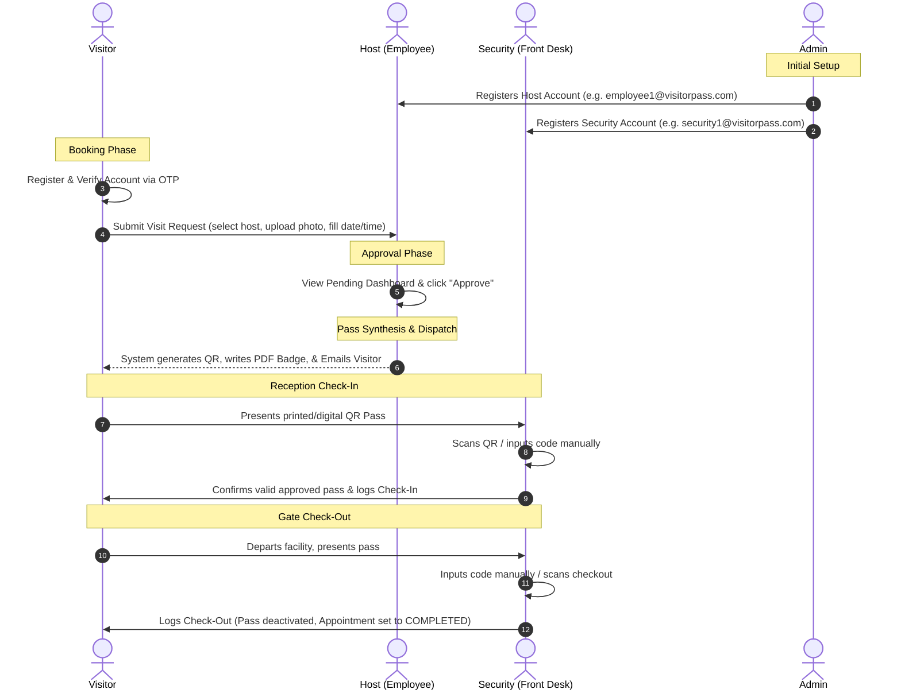

# System Analysis & End-to-End Testing Guide

This guide provides a comprehensive breakdown of the **Visitor Pass Management System (VisiFlow)**, describing the database schemas, roles, complete data workflows, and a step-by-step testing blueprint.

---

## 1. Database Architecture & Model Relationships

The system is built on five core MongoDB collections (and one tracking collection) that define the lifecycle of a visitor's request:



### Core Schema Definitions
1. **User ([User.js](file:///d:/Visitor_Pass_Management_App/backend/src/models/User.js))**: Holds accounts for Admins, Employees/Hosts, Security Officers, and Visitors. Tracks access parameters, status (`ACTIVE`, `INACTIVE`, `SUSPENDED`), verification state (`isVerified` via OTP), and cryptographic passwords.
2. **Visitor ([Visitor.js](file:///d:/Visitor_Pass_Management_App/backend/src/models/Visitor.js))**: Stores the visitor profile (full name, email, company, phone, uploaded photo, and their designated host).
3. **Appointment ([Appointment.js](file:///d:/Visitor_Pass_Management_App/backend/src/models/Appointment.js))**: Details the scheduled visit (date, time, purpose, and host ID) and holds the status (`PENDING`, `APPROVED`, `REJECTED`, `COMPLETED`, `CANCELLED`).
4. **Pass ([Pass.js](file:///d:/Visitor_Pass_Management_App/backend/src/models/Pass.js))**: Synthesized upon appointment approval. Holds the unique pass number (`VP-YYYYMMDD-XXXX`), the base64 QR code, the filesystem path to the PDF badge, status (`APPROVED`, `CHECKED_IN`, `CHECKED_OUT`), and expiration timestamps.
5. **CheckLog ([CheckLog.js](file:///d:/Visitor_Pass_Management_App/backend/src/models/CheckLog.js))**: Logged at the gate by Security. Records actual `checkInTime` and `checkOutTime`.
6. **AuditLog ([AuditLog.js](file:///d:/Visitor_Pass_Management_App/backend/src/models/AuditLog.js))**: Independent ledger logging system modifications (Logins, Approvals, Status changes) for audit reports.

---

## 2. End-to-End Visitor Lifecycle & Data Flow



### Detailed Lifecycle Phases

#### Phase 1: Bootstrap & Prerequisite Data
Before a visitor can book a meeting, **Hosts/Employees must exist** in the system. 
- An **Admin** must log in first and create Employee accounts with designated departments (e.g., Engineering, HR).
- Without hosts, visitors registering on the platform will have no employees to select in the scheduling dropdown.

#### Phase 2: Registration & Appointment Creation
1. The **Visitor** registers, enters their email, and receives a 6-digit email OTP.
2. After submitting the OTP, their account is marked `isVerified: true`.
3. They log in, click **Request New Visit**, fill in host selection, date, time, and purpose, and upload a portrait photo.
4. This creates:
   - A **Visitor** profile record with `status: 'PENDING'`.
   - An **Appointment** record with `approvalStatus: 'PENDING'`.

#### Phase 3: Host Verification & Pass Synthesis
1. The **Host** logs in and sees the pending request in their **Visitor Requests** tab.
2. Clicking **Approve** executes the `/api/appointments/:id/approve` endpoint:
   - Updates the appointment status to `APPROVED`.
   - Generates a unique pass number format: `VP-YYYYMMDD-[4-digit-random-number]`.
   - Assembles a QR code containing `{ passNumber, visitorName, visitDate, hostName }`.
   - Creates a card-sized PDF badge with the visitor's image, pass details, host details, and the QR code, saved under the backend upload directory.
   - Saves a **Pass** record in the database.
   - Dispatches an automated email to the visitor with their PDF badge attached.

#### Phase 4: Gate check-in and check-out
1. The visitor arrives at the facility and presents their PDF badge (printed or on a mobile screen).
2. The **Security Officer** logs in and uses the **Scanner & Gate Control** console:
   - **QR Scan**: Uses the web camera via `react-qr-scanner` to read the QR data.
   - **Manual Input**: Inputs the pass code (e.g., `VP-20260615-1000`) into the text box.
3. Clicking **Check-In** calls `/api/checkin`:
   - Validates that the pass exists, is active, has not expired, and that the visitor isn't already inside.
   - Writes a new **CheckLog** record mapping `visitorId` and `checkInTime`.
   - Sets the pass status to `CHECKED_IN`.
4. When departing, the visitor checks out. Security inputs the pass number and clicks **Check-Out** calling `/api/checkout`:
   - Finds the active check log and timestamps `checkOutTime`.
   - Sets the pass status to `CHECKED_OUT` and `active: false` (deactivating it permanently).
   - Updates the appointment status to `COMPLETED`.

---

## 3. Step-by-Step Testing & Demo Blueprint

Follow this testing guide to verify every workflow of the application:

### Preparatory Stage: Database Reset & Seed
1. Stop any local dev instances.
2. Open a terminal in the `backend/` directory and run:
   ```bash
   npm run seed
   ```
   *This clears the collections and populates pre-configured test users (all passwords are `password123`):*
   - **Admin**: `admin@visitorpass.com`
   - **Employee Host**: `employee1@visitorpass.com`
   - **Security**: `security1@visitorpass.com`
   - **Visitor**: `visitor1@visitorpass.com`

---

### Test 1: Admin Panel and User Creation
1. Open [http://localhost:5173/login](http://localhost:5173/login).
2. Login as **Admin**:
   - **Email**: `admin@visitorpass.com`
   - **Password**: `password123`
3. Click the sidebar links on the left:
   - Click **Manage Users**: Verify the "Designated Personnel Registry" table displays.
   - Click **Manage Visitors**: Verify the "Visitor Profiles" table displays.
   - Click **Reports & Analytics**: Verify the "All Appointment Bookings" table displays.
   - Click **Dashboard**: Verify the analytics cards and charts display.
4. Go to **Manage Users** and register a new Host:
   - Click **Register Personnel**.
   - Fill in: Name: `Sarah Jenkins`, Email: `sarah@company.com`, Password: `password123`, Role: `Employee (Host)`, Department: `Engineering`.
   - Click **Register User**.
   - Verify `Sarah Jenkins` appears in the personnel registry.

---

### Test 2: Visitor Registration, Verification, and Scheduling
1. Log out from the Admin panel.
2. Click **Register** on the landing/login page to sign up a new visitor:
   - Fill in details (Name: `Alex Mercer`, Email: `alex@example.com`, Phone: `+15559988`, Password: `password123`).
   - Click **Sign Up**.
3. You will be redirected to the **OTP Verification** screen.
4. Check the backend server terminal output. You will find a generated Ethereal SMTP account logger showing the OTP email sent:
   - Look for: `[OTP Verification]: Code is XXXXXX`.
   - Copy this 6-digit code, paste it into the UI, and click **Verify Account**.
5. Once verified, log in as the visitor:
   - **Email**: `alex@example.com`
   - **Password**: `password123`
6. Click **Request New Visit**:
   - Fill in Company: `Tesla`, Purpose: `Technical Partnership Audit`.
   - Select host: `Sarah Jenkins` (the employee created in Test 1).
   - Date: Select today's date. Time: `14:00`.
   - Choose a mock photo file to upload.
   - Click **Submit Visit Request**.
7. Verify the booking appears in the visitor dashboard list with status `PENDING`.

---

### Test 3: Host Request Review & Approval
1. Log out as the visitor.
2. Log in as Host **Sarah Jenkins**:
   - **Email**: `sarah@company.com`
   - **Password**: `password123`
3. Go to the **Visitor Requests** tab on the left sidebar:
   - Verify that the pending request from `Alex Mercer` is listed.
4. Click **Approve**.
   - The status in the table should change to `APPROVED` / `Processed`.
5. Check the backend terminal console. It should log:
   - `[SMTP Email Service]: Email sent: Visitor pass VP-YYYYMMDD-XXXX generated.`
   - Note the generated Pass Code (e.g., `VP-20260615-5432`) from the log.

---

### Test 4: Security Reception Gate Operations
1. Log out as the Host.
2. Log in as Security Officer **Frontdesk Security 1**:
   - **Email**: `security1@visitorpass.com`
   - **Password**: `password123`
3. Go to the **Approved Visitors** tab:
   - Verify `Alex Mercer` is listed with a valid approved appointment.
4. Go to the **Scanner & Gate Control** tab:
   - Enter the pass code noted in Test 3 (e.g., `VP-20260615-5432`) in the input box.
   - Click **Check-In**.
   - Verify the screen displays "Verification Successful: Gate Check-In successful for Alex Mercer".
5. Go to the **Logs Ledger** tab:
   - Verify there is an active check-in entry for `Alex Mercer` showing "Active Inside" in green under Check-Out Time.
6. Return to **Scanner & Gate Control**:
   - Enter the pass code `VP-20260615-5432` again.
   - Click **Check-Out**.
   - Verify the screen displays "Check-out successful for Alex Mercer".
7. Go to **Logs Ledger**:
   - Verify the record now shows a timestamp under Check-Out Time.

---

### Test 5: Admin Analytics & Logs Export
1. Log out as Security.
2. Log back in as **Admin** (`admin@visitorpass.com` / `password123`).
3. Click the **Dashboard** (Analytics view):
   - Verify that the counters have updated ("Total Visitors", "Today's Visitors", etc.).
   - Verify that the graphs reflect the visitor status distribution and department workloads.
4. Scroll to the bottom and click **Export CSV Logs**.
   - Verify a file named `Visitor_Logs_YYYY-MM-DD.csv` downloads containing the check-in and check-out times, host details, and security officer ID for the check-in you performed.

---

## 4. Diagnostics & Audit Checklists

Use this checklist to confirm backend processes are executing successfully:

| Workflow Step | Check Database Collections | Check Console / Terminal Logs |
| :--- | :--- | :--- |
| **Visitor Register** | `db.users.find({email: "..."})` matches fields. | Check backend terminal for Ethereal OTP logs. |
| **Book Appointment** | `db.appointments.find()` exists with `approvalStatus: "PENDING"`. | Logs incoming POST request payload. |
| **Approve Visit** | `db.passes.find()` has created pass number, active: true, and base64 QR. | `[AUDIT LOG]` prints `APPOINTMENT_APPROVAL` event. Ethereal prints PDF email dispatch. |
| **Gate Check-In** | `db.checklogs.find()` contains entry with `checkInTime` & security ID. | `[AUDIT LOG]` prints `CHECK_IN` event. |
| **Gate Check-Out** | `db.checklogs.find()` updates with `checkOutTime`. Pass `active` sets to `false`. | `[AUDIT LOG]` prints `CHECK_OUT` event. |
| **Suspended Account** | `db.users.update({email:...}, {$set: {status:"SUSPENDED"}})` | Blocked logins throw `403 Account suspended` in UI. |
